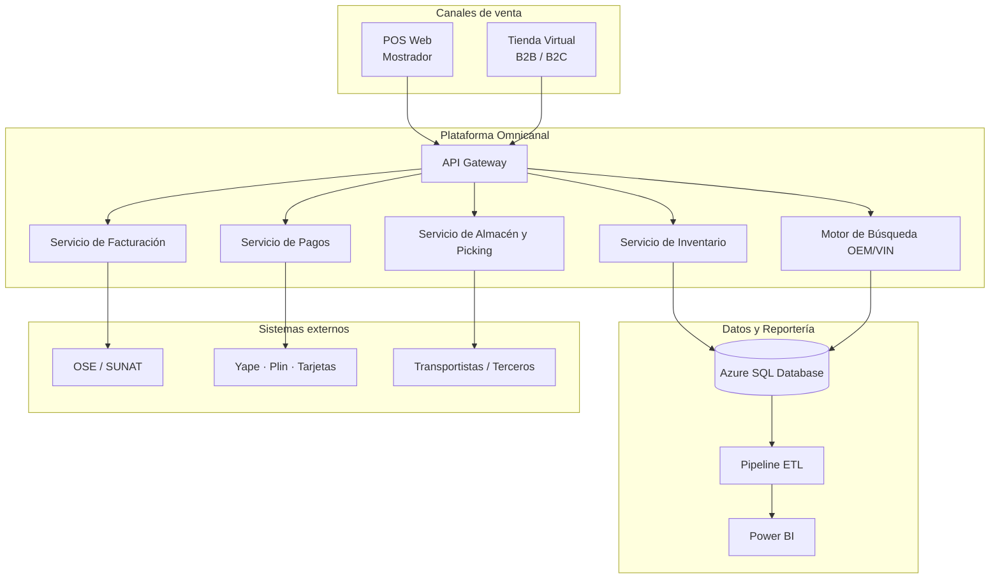
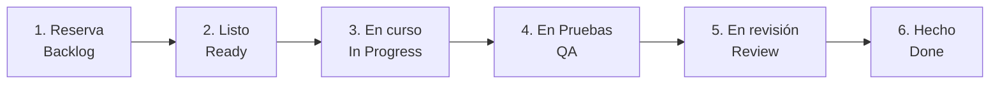
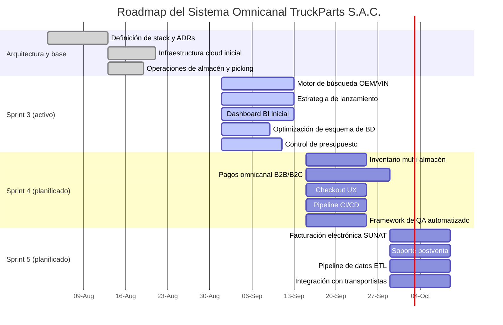

# TruckParts S.A.C. — Sistema Omnicanal de Venta e Importación de Repuestos

**Tablero Kanban del Proyecto — Personal, Arquitectura, Gobernanza y Funciones por Tarea**

Gestión ágil sobre **Azure DevOps** · Repositorio y documentación técnica en **GitHub**

---

## Tabla de contenidos

- [Resumen ejecutivo](#resumen-ejecutivo)
- [Objetivos del proyecto](#objetivos-del-proyecto)
- [Stack tecnológico](#stack-tecnológico)
- [Arquitectura de la solución](#arquitectura-de-la-solución)
- [Requisitos no funcionales](#requisitos-no-funcionales)
- [Personal del proyecto: puestos y responsabilidades](#personal-del-proyecto-puestos-y-responsabilidades)
- [Organigrama funcional](#organigrama-funcional)
- [Matriz RACI de entregables clave](#matriz-raci-de-entregables-clave)
- [Flujo del tablero Kanban (Azure Boards)](#flujo-del-tablero-kanban-azure-boards)
- [Definition of Ready / Definition of Done](#definition-of-ready--definition-of-done)
- [Estrategia de pruebas](#estrategia-de-pruebas)
- [1. Reserva (Backlog)](#1-reserva-backlog)
- [2. Listo (Ready)](#2-listo-ready)
- [3. En curso (In Progress)](#3-en-curso-in-progress)
- [4. En Pruebas (QA)](#4-en-pruebas-qa)
- [5. En revisión (Review)](#5-en-revisión-review)
- [6. Hecho (Done)](#6-hecho-done)
- [Distribución de carga de trabajo por empleado](#distribución-de-carga-de-trabajo-por-empleado)
- [Roadmap de sprints](#roadmap-de-sprints)
- [Gestión de riesgos](#gestión-de-riesgos)
- [Plan de comunicación y ceremonias ágiles](#plan-de-comunicación-y-ceremonias-ágiles)
- [Estándares de contribución](#estándares-de-contribución)
- [Glosario de términos](#glosario-de-términos)
- [Licencia y contacto](#licencia-y-contacto)

---

## Resumen ejecutivo

**Importex** encargó a **TruckParts S.A.C.** el desarrollo de un **sistema omnicanal de venta e importación de repuestos para camiones de carga pesada** (Volvo, Scania, Mercedes-Benz, Freightliner), que integra tienda física (mostrador), tienda virtual (B2B/B2C), facturación electrónica SUNAT, control logístico de importaciones, operaciones de almacén y reportería gerencial. El proyecto se gestiona bajo metodología ágil (Scrum) usando **Azure DevOps** para el tablero Kanban y **GitHub** para el versionamiento del código y la documentación técnica.

Para garantizar una cobertura funcional, técnica y operativa integral, el equipo se amplió de **seis a veinte puestos de trabajo**, incorporando roles especializados en arquitectura de soluciones, administración de bases de datos, automatización de pruebas, integraciones con terceros, operaciones de almacén, control de costos del proyecto, gestión del cambio, experiencia de usuario, infraestructura en la nube, marketing omnicanal, atención al cliente, inteligencia de negocio y seguridad de la información. Cada puesto tiene funciones documentadas y trazables a tareas concretas del tablero Kanban, con una matriz RACI que define responsabilidades sobre los entregables clave del proyecto.

## Objetivos del proyecto

- Unificar la venta presencial (mostrador) y virtual (B2B/B2C) en una sola plataforma de inventario y precios.
- Automatizar la emisión de comprobantes electrónicos conforme a los requisitos de SUNAT.
- Reducir el tiempo de atención en mostrador a menos de un minuto por transacción estándar.
- Dar trazabilidad completa al costo de importación (FOB, flete, Ad Valorem, IGV) hasta el precio final de venta.
- Ofrecer un motor de búsqueda de repuestos por código OEM, marca y VIN que elimine errores de compatibilidad.
- Entregar reportería gerencial (BI) sobre ventas, stock e importaciones para la toma de decisiones.
- Garantizar el cumplimiento normativo de protección de datos personales (Ley N.° 29733) en todo el flujo transaccional.
- Mantener trazabilidad de costos y presupuesto del proyecto a lo largo de todos los sprints.
- Asegurar la adopción del sistema por parte de los usuarios finales mediante un plan formal de capacitación.

## Stack tecnológico

| Capa | Tecnología |
|---|---|
| Backend | .NET Core (C#) — API REST |
| Frontend / POS Web | React + TypeScript |
| Base de datos transaccional | SQL Server (Azure SQL Database) |
| Reportería / BI | Power BI + Azure Synapse (capa analítica) |
| Mensajería / integración | Azure Service Bus |
| Facturación electrónica | Integración OSE/SUNAT (API REST) |
| Infraestructura | Azure App Service, Azure Storage, Azure Key Vault |
| CI/CD | Azure DevOps Pipelines, integrado con GitHub |
| Control de versiones | GitHub (monorepo por dominio) |
| Pruebas manuales | Azure Test Plans (QA funcional) |
| Pruebas automatizadas | xUnit (backend), Playwright (frontend/e2e), Postman/Newman (API) |

## Arquitectura de la solución

## Requisitos no funcionales

| Categoría | Requisito |
|---|---|
| Rendimiento | El POS debe emitir la pre-factura en menos de un minuto por transacción estándar. |
| Disponibilidad | 99.5% de disponibilidad mensual para los servicios de venta (POS y tienda virtual). |
| Escalabilidad | Los servicios de catálogo y pagos deben soportar picos de tráfico de campañas sin degradar el tiempo de respuesta. |
| Seguridad | Cifrado en tránsito y en reposo para datos de pago y datos personales, conforme a la Ley N.° 29733. |
| Auditoría | Registro de auditoría (logs) de todas las transacciones financieras y cambios de precio. |
| Usabilidad | Interfaz del POS operable por personal nuevo con menos de 30 minutos de capacitación. |
| Mantenibilidad | Cobertura mínima de pruebas automatizadas del 70% en los servicios backend críticos. |
| Recuperación ante desastres | Punto de recuperación objetivo (RPO) de 1 hora y tiempo de recuperación objetivo (RTO) de 4 horas. |

---

## Personal del proyecto: puestos y responsabilidades

La empresa Importex asignó al proyecto un equipo de **veinte puestos de trabajo**, distribuidos entre arquitectura, desarrollo técnico, datos, calidad, experiencia de usuario, infraestructura, gestión de producto, operaciones, marketing, atención al cliente, inteligencia de negocio, gestión del proyecto, logística de importaciones y cumplimiento normativo, siguiendo la metodología ágil. A continuación se identifica a cada empleado únicamente por su puesto, sin exponer datos personales.

| Empleado | Puesto en la empresa | Responsabilidades generales del puesto | Dedicación al proyecto |
|---|---|---|---|
| **Empleado 1** | Scrum Master / Tech Lead | Coordina el proyecto bajo metodología ágil, facilita ceremonias (daily, planning, retro), administra la configuración del tablero en Azure DevOps, define los estándares de arquitectura y consolida la documentación técnica en GitHub. | Tiempo parcial — Coordinación |
| **Empleado 2** | Desarrollador Backend | Diseña y desarrolla la lógica del servidor: modelos de datos, endpoints, integraciones con SUNAT y motores de búsqueda del catálogo técnico. Optimiza consultas y garantiza la escalabilidad de los servicios. | Tiempo completo — Desarrollo |
| **Empleado 3** | Desarrollador Frontend / Full Stack | Construye las interfaces web (POS, pagos) y da soporte full stack en la integración entre frontend y los servicios desarrollados por el área backend. | Tiempo completo — Desarrollo |
| **Empleado 4** | Product Owner | Prioriza el Product Backlog, define criterios de aceptación, representa la visión de negocio y aprueba los entregables antes del cierre de cada tarea. | Tiempo parcial — Gestión de producto |
| **Empleado 5** | Analista Funcional / QA | Levanta requerimientos funcionales, diseña casos de prueba y ejecuta las validaciones de calidad (QA) antes de que una tarea pase a revisión final. | Tiempo completo — Calidad |
| **Empleado 6** | Analista de Importaciones y Logística | Gestiona la información de importaciones (costos FOB, flete, impuestos), define políticas de stock y valida el cumplimiento contable de los procesos logísticos. | Tiempo parcial — Logística e Importaciones |
| **Empleado 7** | Diseñador(a) UI/UX | Diseña los flujos de experiencia de usuario para el POS, la tienda virtual y el panel administrativo; construye prototipos navegables, define el sistema de diseño (design system) y valida la usabilidad con pruebas de accesibilidad. | Tiempo parcial — Experiencia de usuario |
| **Empleado 8** | Ingeniero(a) DevOps / Cloud (Azure) | Configura y mantiene la infraestructura en Azure, implementa pipelines de integración y despliegue continuo (CI/CD) conectados al repositorio de GitHub, gestiona ambientes (dev, QA, producción) y monitorea el rendimiento y la disponibilidad del sistema. | Tiempo completo — Infraestructura |
| **Empleado 9** | Especialista en Marketing Digital y Canales Omnicanales | Define la estrategia de posicionamiento del canal virtual, coordina campañas de lanzamiento, da seguimiento a métricas de conversión B2B/B2C y articula la comunicación entre el equipo comercial y el equipo de producto. | Tiempo parcial — Marketing y Canales |
| **Empleado 10** | Analista de Seguridad de la Información y Cumplimiento Normativo | Audita el manejo de datos personales y financieros conforme a la Ley N.° 29733, valida controles de seguridad en pagos y facturación electrónica, y define políticas de acceso y respaldo de la información. | Tiempo parcial — Seguridad y Cumplimiento |
| **Empleado 11** | Arquitecto(a) de Soluciones | Define la arquitectura general del sistema, documenta las decisiones técnicas (ADRs), evalúa la escalabilidad de los servicios y valida que cada nuevo módulo respete los estándares de integración de la plataforma. | Tiempo parcial — Arquitectura |
| **Empleado 12** | Ingeniero(a) de Datos | Construye los pipelines ETL que trasladan la información transaccional hacia la capa analítica, modela las estructuras de datos para reportería y garantiza la calidad e integridad de los datos utilizados en BI. | Tiempo completo — Datos |
| **Empleado 13** | Especialista en Atención al Cliente y Soporte Postventa | Integra los canales de soporte (chat, ticketing, telefonía) con la plataforma omnicanal, define los tiempos de respuesta objetivo (SLA) y documenta los procesos de atención de reclamos y devoluciones. | Tiempo parcial — Atención al Cliente |
| **Empleado 14** | Analista de Business Intelligence (BI) y Reportería | Diseña los tableros gerenciales de ventas, stock e importaciones en Power BI, define los indicadores clave de desempeño (KPIs) del negocio y capacita a las áreas usuarias en la lectura de los reportes. | Tiempo parcial — Inteligencia de Negocio |
| **Empleado 15** | Ingeniero(a) de QA Automatizado | Diseña y mantiene el framework de pruebas automatizadas (unitarias, de integración y end-to-end), integra las suites de prueba al pipeline de CI/CD y reduce el tiempo de regresión manual del equipo de QA funcional. | Tiempo completo — Calidad |
| **Empleado 16** | Administrador(a) de Base de Datos (DBA) | Diseña y optimiza el esquema de base de datos transaccional, define políticas de respaldo y recuperación, monitorea el rendimiento de consultas críticas y gestiona los índices y particiones de las tablas de mayor volumen. | Tiempo parcial — Datos e Infraestructura |
| **Empleado 17** | Especialista en Integraciones y Terceros | Gestiona las integraciones con transportistas, operadores logísticos y otros sistemas externos al proyecto, define los contratos de API con terceros y da seguimiento a los acuerdos de nivel de servicio (SLA) externos. | Tiempo parcial — Integraciones |
| **Empleado 18** | Coordinador(a) de Operaciones de Almacén | Define los procesos de picking, packing y despacho de repuestos pesados, valida la asignación de ubicaciones dentro del almacén central y coordina con el equipo técnico la lógica de notificación automática al almacén. | Tiempo parcial — Operaciones |
| **Empleado 19** | Analista de Costos y Presupuesto del Proyecto | Da seguimiento al presupuesto asignado al proyecto por sprint, controla la ejecución del gasto frente a lo planificado y reporta desviaciones al Product Owner y al Scrum Master. | Tiempo parcial — Gestión de Proyecto |
| **Empleado 20** | Especialista en Capacitación y Gestión del Cambio | Diseña el plan de capacitación para los usuarios finales (personal de mostrador, almacén y atención al cliente), elabora material de entrenamiento y mide la adopción del sistema tras cada despliegue. | Tiempo parcial — Gestión del Cambio |

## Organigrama funcional

```mermaid
graph TD
    SM["Empleado 1<br/>Scrum Master / Tech Lead"]
    ARQ["Empleado 11<br/>Arquitecto(a) de Soluciones"]

    SM --> ARQ
    SM --> BE["Empleado 2<br/>Desarrollador Backend"]
    SM --> FE["Empleado 3<br/>Desarrollador Frontend / Full Stack"]
    SM --> PO["Empleado 4<br/>Product Owner"]
    SM --> QA["Empleado 5<br/>Analista Funcional / QA"]
    SM --> LOG["Empleado 6<br/>Analista de Importaciones y Logística"]
    SM --> UX["Empleado 7<br/>Diseñador(a) UI/UX"]
    SM --> OPS["Empleado 8<br/>Ingeniero(a) DevOps / Cloud"]
    SM --> MKT["Empleado 9<br/>Especialista en Marketing Digital"]
    SM --> SEC["Empleado 10<br/>Analista de Seguridad y Cumplimiento"]
    SM --> DATA["Empleado 12<br/>Ingeniero(a) de Datos"]
    SM --> CS["Empleado 13<br/>Atención al Cliente y Postventa"]
    SM --> BI["Empleado 14<br/>Analista de BI y Reportería"]
    SM --> QAA["Empleado 15<br/>Ingeniero(a) de QA Automatizado"]
    SM --> DBA["Empleado 16<br/>Administrador(a) de BD"]
    SM --> INT["Empleado 17<br/>Integraciones y Terceros"]
    SM --> WH["Empleado 18<br/>Coordinador(a) de Almacén"]
    SM --> COST["Empleado 19<br/>Costos y Presupuesto"]
    SM --> CHG["Empleado 20<br/>Capacitación y Gestión del Cambio"]

    ARQ -.define estándares.-> BE
    ARQ -.define estándares.-> FE
    ARQ -.define estándares.-> OPS
    PO -.prioriza.-> BE
    PO -.prioriza.-> FE
    UX -.entrega diseños.-> FE
    OPS -.despliega.-> BE
    OPS -.despliega.-> FE
    QA -.valida.-> BE
    QA -.valida.-> FE
    QAA -.automatiza.-> QA
    DBA -.optimiza esquema.-> BE
    SEC -.audita.-> BE
    SEC -.audita.-> LOG
    MKT -.coordina con.-> PO
    DATA -.alimenta.-> BI
    LOG -.insumos de costos.-> DATA
    LOG -.coordina con.-> WH
    INT -.gestiona terceros.-> WH
    CS -.retroalimenta.-> PO
    COST -.reporta a.-> PO
    CHG -.capacita usuarios de.-> CS
    CHG -.capacita usuarios de.-> WH
```

## Matriz RACI de entregables clave

**R** = Responsable (ejecuta) · **A** = Aprueba (rinde cuentas) · **C** = Consultado · **I** = Informado

| Entregable | Tech Lead (1) | Backend (2) | Frontend (3) | Product Owner (4) | QA Funcional (5) | Importaciones (6) | UX (7) | DevOps (8) | Arquitecto (11) | Seguridad (10) |
|---|---|---|---|---|---|---|---|---|---|---|
| Arquitectura del sistema | C | I | I | I | I | — | I | C | **A/R** | C |
| Módulo de inventario | I | **R** | I | A | C | C | — | C | C | — |
| Pasarela de pagos | I | C | **R** | A | C | — | C | C | C | **C** |
| Facturación electrónica SUNAT | I | **R** | I | A | C | C | — | C | — | C |
| POS Web (mostrador) | I | C | **R** | A | **R** | — | C | C | — | — |
| Infraestructura y despliegue | C | I | I | I | I | — | — | **A/R** | C | C |
| Auditoría de seguridad y datos personales | I | C | I | I | I | — | — | C | I | **A/R** |
| Reportería y BI | I | I | — | A | — | C | — | — | I | — |

---

## Flujo del tablero Kanban (Azure Boards)

El tablero se organiza en seis columnas que reflejan el ciclo de vida completo de cada funcionalidad, desde su ingreso al backlog hasta su cierre y publicación en el repositorio del proyecto en GitHub. Se incorporó la columna **"En Pruebas (QA)"** para formalizar la validación funcional antes del pase a revisión final, fortaleciendo el control de calidad del equipo.

1. **Reserva (Backlog)** — funcionalidades priorizadas pendientes de iniciar.
2. **Listo (Ready)** — funcionalidades refinadas y listas para desarrollo.
3. **En curso (In Progress)** — funcionalidades en desarrollo activo.
4. **En Pruebas (QA)** — validación funcional y de calidad antes de la revisión final.
5. **En revisión (Review)** — funcionalidades evaluadas por el equipo antes del cierre.
6. **Hecho (Done)** — funcionalidades completadas, aprobadas y documentadas.

## Definition of Ready / Definition of Done

**Definition of Ready (DoR)** — una tarea puede entrar a "Listo" cuando:
- Tiene historias de usuario desglosadas y estimadas por el equipo.
- El Product Owner definió los criterios de aceptación.
- No existen dependencias técnicas bloqueantes sin resolver.
- El diseño UX (si aplica) fue aprobado.

**Definition of Done (DoD)** — una tarea puede cerrarse en "Hecho" cuando:
- Superó QA (manual y automatizado) sin incidencias críticas o altas abiertas.
- El código fue revisado y aprobado en Pull Request (mínimo un revisor).
- El pipeline de CI/CD desplegó exitosamente en el ambiente correspondiente.
- La documentación técnica fue actualizada en GitHub.
- El Product Owner aprobó el entregable frente al criterio de negocio.

## Estrategia de pruebas

| Nivel | Responsable | Herramienta | Frecuencia |
|---|---|---|---|
| Pruebas unitarias | Desarrollador Backend / Frontend | xUnit, React Testing Library | En cada Pull Request |
| Pruebas de integración | Ingeniero(a) de QA Automatizado | Postman/Newman | En cada build del pipeline CI |
| Pruebas end-to-end | Ingeniero(a) de QA Automatizado | Playwright | Antes de cada despliegue a QA |
| Pruebas funcionales manuales | Analista Funcional / QA | Azure Test Plans | En la columna "En Pruebas (QA)" |
| Pruebas de seguridad | Analista de Seguridad y Cumplimiento | Revisión manual + checklist OWASP | Antes de cada release a producción |
| Pruebas de aceptación de usuario (UAT) | Product Owner + usuarios clave | Ambiente de QA | Antes del cierre de cada Feature |

---

## 1. Reserva (Backlog)

*Funcionalidades priorizadas en el Product Backlog, pendientes de asignación de sprint.*

| Tarea | Empleado responsable | Puesto asignado | Empleado colaborador |
|---|---|---|---|
| Módulo de Gestión de Inventario Multi-almacén y Sincronización de Stock | **Empleado 2** | Desarrollador Backend | Empleado 6 — Analista de Importaciones y Logística |
| Integración de Pasarela de Pagos Omnicanal B2B/B2C | **Empleado 3** | Desarrollador Frontend / Full Stack | Empleado 4 — Product Owner |
| Emisión de Comprobantes Electrónicos SUNAT (Facturación y Boletas) | **Empleado 2** | Desarrollador Backend | Empleado 6 — Analista de Importaciones y Logística |
| Automatización de Pipeline CI/CD en Azure DevOps | **Empleado 8** | Ingeniero(a) DevOps / Cloud | Empleado 2 — Desarrollador Backend |
| Diseño de Arquitectura de Microservicios y Registro de Decisiones (ADRs) | **Empleado 11** | Arquitecto(a) de Soluciones | Empleado 1 — Scrum Master / Tech Lead |
| Pipeline de Datos para Reportería (ETL hacia capa analítica) | **Empleado 12** | Ingeniero(a) de Datos | Empleado 6 — Analista de Importaciones y Logística |
| Diseño y Optimización del Esquema de Base de Datos | **Empleado 16** | Administrador(a) de Base de Datos | Empleado 2 — Desarrollador Backend |
| Framework de Automatización de Pruebas de Regresión | **Empleado 15** | Ingeniero(a) de QA Automatizado | Empleado 5 — Analista Funcional / QA |

### Módulo de Gestión de Inventario Multi-almacén y Sincronización de Stock

| Campo | Detalle |
|---|---|
| **Empleado responsable / Puesto** | Empleado 2 — Desarrollador Backend |
| **Función asignada a este puesto** | Diseñar el modelo de datos del inventario, implementar los endpoints de consulta de stock en tiempo real y desarrollar la lógica de sincronización entre almacén central y tienda. |
| **Empleado colaborador / Puesto** | Empleado 6 — Analista de Importaciones y Logística |
| **Función de apoyo de este puesto** | Definir las reglas de negocio para las alertas de stock mínimo y validar los criterios de transferencia entre sedes desde el área de importaciones. |
| **Funcionalidad** | Sistema de control de existencias en tiempo real que conecta el Almacén Central de Importaciones con la Tienda Principal de Mostrador. |
| **Detalles** | Permite consultar disponibilidad, registrar alertas automáticas de stock mínimo, gestionar transferencias entre sedes y procesar kárdex de entrada/salida de repuestos pesados. |
| **Prioridad** | Alta |
| **Estimación** | 8 puntos de historia (≈5 días hábiles) |
| **Work Item (Azure DevOps)** | Feature con 3 Product Backlog Items (PBIs) asociados |
| **Etiquetas / Tags** | Inventario · Backend · Multi-almacén |
| **Sprint asignado** | Sprint 4 (planificado) |

### Integración de Pasarela de Pagos Omnicanal B2B/B2C

| Campo | Detalle |
|---|---|
| **Empleado responsable / Puesto** | Empleado 3 — Desarrollador Frontend / Full Stack |
| **Función asignada a este puesto** | Integrar los SDK/API de Yape, Plin y la pasarela de tarjetas; implementar el flujo de generación de órdenes de compra con transferencia bancaria. |
| **Empleado colaborador / Puesto** | Empleado 4 — Product Owner |
| **Función de apoyo de este puesto** | Definir el flujo de aprobación de pagos corporativos B2B para flotas de transporte y priorizar los criterios de negocio de conciliación. |
| **Funcionalidad** | Módulo de procesamiento de pagos seguro para compras de repuestos en la web. |
| **Detalles** | Soporte para billeteras digitales (Yape, Plin), tarjetas de crédito/débito y generación de órdenes de compra con transferencia bancaria para clientes corporativos (flotas de transporte). |
| **Prioridad** | Alta |
| **Estimación** | 13 puntos de historia (≈8 días hábiles) |
| **Work Item (Azure DevOps)** | Feature con 4 PBIs asociados |
| **Etiquetas / Tags** | Pagos · Omnicanal · B2B · B2C |
| **Sprint asignado** | Sprint 4 (planificado) |

### Emisión de Comprobantes Electrónicos SUNAT (Facturación y Boletas)

| Campo | Detalle |
|---|---|
| **Empleado responsable / Puesto** | Empleado 2 — Desarrollador Backend |
| **Función asignada a este puesto** | Desarrollar el servicio de integración con el Operador de Servicios Electrónicos (OSE)/SUNAT y la generación de archivos XML/PDF con cálculo automático de IGV. |
| **Empleado colaborador / Puesto** | Empleado 6 — Analista de Importaciones y Logística |
| **Función de apoyo de este puesto** | Validar el cumplimiento normativo y contable de los comprobantes electrónicos y definir los casos de prueba fiscales requeridos por SUNAT. |
| **Funcionalidad** | Generador automático de documentos contables integrado con el flujo de ventas. |
| **Detalles** | Creación de boletas, facturas y guías de remisión en formato PDF y XML, cálculo automático de IGV y envío automático del comprobante al correo del cliente. |
| **Prioridad** | Crítica (requisito legal) |
| **Estimación** | 8 puntos de historia (≈5 días hábiles) |
| **Work Item (Azure DevOps)** | Feature con 3 PBIs asociados |
| **Etiquetas / Tags** | SUNAT · Facturación · Compliance |
| **Sprint asignado** | Sprint 5 (planificado) |

### Automatización de Pipeline CI/CD en Azure DevOps

| Campo | Detalle |
|---|---|
| **Empleado responsable / Puesto** | Empleado 8 — Ingeniero(a) DevOps / Cloud |
| **Función asignada a este puesto** | Configurar pipelines de build, pruebas automatizadas y despliegue continuo entre el repositorio de GitHub y los ambientes de Azure (dev, QA, producción). |
| **Empleado colaborador / Puesto** | Empleado 2 — Desarrollador Backend |
| **Función de apoyo de este puesto** | Adaptar la estructura del proyecto backend a los requisitos del pipeline (scripts de build, variables de entorno, pruebas unitarias). |
| **Funcionalidad** | Flujo automatizado de integración y entrega continua para todos los módulos del sistema. |
| **Detalles** | Ejecución automática de pruebas al hacer push, despliegue a ambiente de QA tras aprobación de Pull Request y despliegue a producción mediante aprobación manual del Tech Lead. |
| **Prioridad** | Alta |
| **Estimación** | 8 puntos de historia (≈5 días hábiles) |
| **Work Item (Azure DevOps)** | Feature con 3 PBIs asociados |
| **Etiquetas / Tags** | DevOps · CI/CD · Azure |
| **Sprint asignado** | Sprint 4 (planificado) |

### Diseño de Arquitectura de Microservicios y Registro de Decisiones (ADRs)

| Campo | Detalle |
|---|---|
| **Empleado responsable / Puesto** | Empleado 11 — Arquitecto(a) de Soluciones |
| **Función asignada a este puesto** | Definir los límites de cada microservicio (inventario, pagos, facturación, catálogo, almacén), documentar las decisiones técnicas relevantes en Architecture Decision Records (ADRs) y establecer los contratos de comunicación entre servicios. |
| **Empleado colaborador / Puesto** | Empleado 1 — Scrum Master / Tech Lead |
| **Función de apoyo de este puesto** | Validar que la propuesta de arquitectura sea viable dentro de los plazos del roadmap y comunicarla al resto del equipo técnico. |
| **Funcionalidad** | Base arquitectónica formal que guía el desarrollo de todos los módulos del sistema. |
| **Detalles** | Incluye diagrama de componentes, definición del API Gateway, estrategia de versionamiento de APIs y criterios de escalabilidad horizontal para los servicios de mayor demanda (catálogo y pagos). |
| **Prioridad** | Alta |
| **Estimación** | 8 puntos de historia (≈5 días hábiles) |
| **Work Item (Azure DevOps)** | Feature con 2 PBIs asociados |
| **Etiquetas / Tags** | Arquitectura · ADR · Microservicios |
| **Sprint asignado** | Sprint 3 (planificado) |

### Pipeline de Datos para Reportería (ETL hacia capa analítica)

| Campo | Detalle |
|---|---|
| **Empleado responsable / Puesto** | Empleado 12 — Ingeniero(a) de Datos |
| **Función asignada a este puesto** | Diseñar el proceso ETL que extrae la información transaccional (ventas, stock, importaciones) hacia la capa analítica, y modelar las tablas de hechos y dimensiones para los reportes gerenciales. |
| **Empleado colaborador / Puesto** | Empleado 6 — Analista de Importaciones y Logística |
| **Función de apoyo de este puesto** | Validar la correcta interpretación de los costos de importación en el modelo de datos analítico. |
| **Funcionalidad** | Flujo automatizado de sincronización de datos entre la base transaccional y la plataforma de Business Intelligence. |
| **Detalles** | Ejecución programada (diaria) del proceso ETL, validaciones de calidad de datos y alertas automáticas ante inconsistencias en el origen. |
| **Prioridad** | Media-Alta |
| **Estimación** | 8 puntos de historia (≈5 días hábiles) |
| **Work Item (Azure DevOps)** | Feature con 3 PBIs asociados |
| **Etiquetas / Tags** | Datos · ETL · BI |
| **Sprint asignado** | Sprint 5 (planificado) |

### Diseño y Optimización del Esquema de Base de Datos

| Campo | Detalle |
|---|---|
| **Empleado responsable / Puesto** | Empleado 16 — Administrador(a) de Base de Datos (DBA) |
| **Función asignada a este puesto** | Definir el modelo físico de la base de datos, establecer índices y particiones para las tablas de mayor volumen (inventario, transacciones) y configurar las políticas de respaldo y recuperación. |
| **Empleado colaborador / Puesto** | Empleado 2 — Desarrollador Backend |
| **Función de apoyo de este puesto** | Adaptar los modelos de datos de la aplicación al esquema optimizado propuesto por el DBA. |
| **Funcionalidad** | Base de datos transaccional optimizada para consultas de alta frecuencia (consulta de stock, búsqueda de catálogo). |
| **Detalles** | Incluye estrategia de particionamiento por almacén, plan de respaldo diario e índices específicos para las consultas del motor de búsqueda OEM/VIN. |
| **Prioridad** | Alta |
| **Estimación** | 5 puntos de historia (≈3 días hábiles) |
| **Work Item (Azure DevOps)** | Feature con 2 PBIs asociados |
| **Etiquetas / Tags** | Base de Datos · DBA · Rendimiento |
| **Sprint asignado** | Sprint 3 (planificado) |

### Framework de Automatización de Pruebas de Regresión

| Campo | Detalle |
|---|---|
| **Empleado responsable / Puesto** | Empleado 15 — Ingeniero(a) de QA Automatizado |
| **Función asignada a este puesto** | Diseñar el framework de automatización de pruebas end-to-end y de integración, e integrarlo al pipeline de CI/CD para su ejecución en cada despliegue. |
| **Empleado colaborador / Puesto** | Empleado 5 — Analista Funcional / QA |
| **Función de apoyo de este puesto** | Priorizar los casos de prueba manuales que deben automatizarse primero según el riesgo funcional. |
| **Funcionalidad** | Suite de pruebas automatizadas que reduce el tiempo de regresión manual antes de cada release. |
| **Detalles** | Cobertura inicial sobre los flujos críticos: emisión de pre-factura en POS, cálculo de IGV y sincronización de stock. |
| **Prioridad** | Media-Alta |
| **Estimación** | 8 puntos de historia (≈5 días hábiles) |
| **Work Item (Azure DevOps)** | Feature con 3 PBIs asociados |
| **Etiquetas / Tags** | QA · Automatización · CI/CD |
| **Sprint asignado** | Sprint 4 (planificado) |

---

## 2. Listo (Ready)

*Funcionalidades refinadas, con historias de usuario desglosadas y estimadas, listas para iniciar desarrollo.*

| Tarea | Empleado responsable | Puesto asignado | Empleado colaborador |
|---|---|---|---|
| Interfaz de Punto de Venta (POS Web) para Atención Presencial en Mostrador | **Empleado 5** | Analista Funcional / QA | Empleado 3 — Desarrollador Frontend / Full Stack |
| Diseño de Experiencia de Usuario (UX) para Checkout Omnicanal | **Empleado 7** | Diseñador(a) UI/UX | Empleado 3 — Desarrollador Frontend / Full Stack |
| Integración de Canal de Soporte Postventa (Ticketing y Chat) | **Empleado 13** | Especialista en Atención al Cliente | Empleado 3 — Desarrollador Frontend / Full Stack |
| Integración con Proveedores Logísticos y Transportistas | **Empleado 17** | Especialista en Integraciones y Terceros | Empleado 6 — Analista de Importaciones y Logística |

### Interfaz de Punto de Venta (POS Web) para Atención Presencial en Mostrador

| Campo | Detalle |
|---|---|
| **Empleado responsable / Puesto** | Empleado 5 — Analista Funcional / QA |
| **Función asignada a este puesto** | Definir y validar el flujo de atención en mostrador, los criterios de descuento por volumen y el tiempo de respuesta objetivo del POS. |
| **Empleado colaborador / Puesto** | Empleado 3 — Desarrollador Frontend / Full Stack |
| **Función de apoyo de este puesto** | Implementar la interfaz web, la lectura por escáner de código de barras y la lógica de emisión de la pre-factura. |
| **Funcionalidad** | Aplicación web ultra rápida diseñada para el personal de ventas físicas en tienda. |
| **Detalles** | Permite agregar productos al carrito mediante escáner de código de barras o búsqueda rápida, aplicar descuentos por volumen, seleccionar el tipo de comprobante y emitir la pre-factura en caja en menos de un minuto. |
| **Prioridad** | Alta |
| **Estimación** | 5 puntos de historia — PBIs desglosados y refinados |
| **Work Item (Azure DevOps)** | Feature refinado y listo (Ready for Development) |
| **Etiquetas / Tags** | POS · Mostrador · UX |
| **Sprint asignado** | Sprint 3 |

### Diseño de Experiencia de Usuario (UX) para Checkout Omnicanal

| Campo | Detalle |
|---|---|
| **Empleado responsable / Puesto** | Empleado 7 — Diseñador(a) UI/UX |
| **Función asignada a este puesto** | Diseñar el flujo de checkout unificado para tienda virtual y mostrador, incluyendo wireframes, prototipo navegable y guía de estilo (design system). |
| **Empleado colaborador / Puesto** | Empleado 3 — Desarrollador Frontend / Full Stack |
| **Función de apoyo de este puesto** | Validar la factibilidad técnica de los componentes propuestos e implementar el prototipo aprobado en producción. |
| **Funcionalidad** | Experiencia de compra consistente entre canales, reduciendo pasos de fricción en el proceso de pago. |
| **Detalles** | Incluye pruebas de usabilidad con usuarios reales del área comercial, ajuste de jerarquía visual para pantallas táctiles del mostrador y accesibilidad (contraste, tamaños de botón). |
| **Prioridad** | Media-Alta |
| **Estimación** | 5 puntos de historia — PBIs desglosados y refinados |
| **Work Item (Azure DevOps)** | Feature refinado y listo (Ready for Development) |
| **Etiquetas / Tags** | UX · Diseño · Checkout |
| **Sprint asignado** | Sprint 4 |

### Integración de Canal de Soporte Postventa (Ticketing y Chat)

| Campo | Detalle |
|---|---|
| **Empleado responsable / Puesto** | Empleado 13 — Especialista en Atención al Cliente y Soporte Postventa |
| **Función asignada a este puesto** | Definir el flujo de atención de reclamos y devoluciones, establecer los tiempos de respuesta objetivo (SLA) por canal y documentar el árbol de derivación de casos. |
| **Empleado colaborador / Puesto** | Empleado 3 — Desarrollador Frontend / Full Stack |
| **Función de apoyo de este puesto** | Implementar el widget de chat y la integración con la herramienta de ticketing dentro de la tienda virtual. |
| **Funcionalidad** | Canal unificado de soporte postventa accesible desde la tienda virtual y el panel administrativo. |
| **Detalles** | Incluye clasificación automática de tickets por tipo de incidencia (producto, pago, envío), notificaciones al cliente por correo y métricas de tiempo de resolución. |
| **Prioridad** | Media |
| **Estimación** | 5 puntos de historia — PBIs desglosados y refinados |
| **Work Item (Azure DevOps)** | Feature refinado y listo (Ready for Development) |
| **Etiquetas / Tags** | Soporte · Postventa · Ticketing |
| **Sprint asignado** | Sprint 5 |

### Integración con Proveedores Logísticos y Transportistas

| Campo | Detalle |
|---|---|
| **Empleado responsable / Puesto** | Empleado 17 — Especialista en Integraciones y Terceros |
| **Función asignada a este puesto** | Definir el contrato de API con los transportistas asociados, establecer el formato de intercambio de información de despacho y negociar los SLA de entrega. |
| **Empleado colaborador / Puesto** | Empleado 6 — Analista de Importaciones y Logística |
| **Función de apoyo de este puesto** | Validar que la información de costos de flete se refleje correctamente en el módulo de importaciones. |
| **Funcionalidad** | Integración con transportistas externos para el seguimiento del despacho de pedidos de la tienda virtual. |
| **Detalles** | Incluye notificación automática al cliente del estado de envío y actualización del estado del pedido en el panel administrativo. |
| **Prioridad** | Media |
| **Estimación** | 5 puntos de historia — PBIs desglosados y refinados |
| **Work Item (Azure DevOps)** | Feature refinado y listo (Ready for Development) |
| **Etiquetas / Tags** | Integraciones · Logística · Terceros |
| **Sprint asignado** | Sprint 5 |

---

## 3. En curso (In Progress)

*Funcionalidades en desarrollo activo dentro del sprint vigente.*

| Tarea | Empleado responsable | Puesto asignado | Empleado colaborador |
|---|---|---|---|
| Motor de Búsqueda Avanzado de Repuestos por Código OEM, Marca y VIN | **Empleado 2** | Desarrollador Backend | Empleado 5 — Analista Funcional / QA |
| Estrategia de Lanzamiento y Posicionamiento Omnicanal | **Empleado 9** | Especialista en Marketing Digital | Empleado 4 — Product Owner |
| Dashboard de Business Intelligence: Ventas, Stock e Importaciones | **Empleado 14** | Analista de BI y Reportería | Empleado 12 — Ingeniero(a) de Datos |
| Control de Presupuesto y Costos del Proyecto | **Empleado 19** | Analista de Costos y Presupuesto | Empleado 4 — Product Owner |

### Motor de Búsqueda Avanzado de Repuestos por Código OEM, Marca y VIN

| Campo | Detalle |
|---|---|
| **Empleado responsable / Puesto** | Empleado 2 — Desarrollador Backend |
| **Función asignada a este puesto** | Desarrollar el algoritmo de búsqueda y matching por código OEM, modelo y VIN, optimizando las consultas sobre el catálogo técnico. |
| **Empleado colaborador / Puesto** | Empleado 5 — Analista Funcional / QA |
| **Función de apoyo de este puesto** | Curar las tablas de equivalencia entre marcas y validar los resultados de búsqueda contra datos reales del catálogo. |
| **Funcionalidad** | Catálogo interactivo con filtrado multinivel para piezas de carga pesada. |
| **Detalles** | Desarrollo del algoritmo de búsqueda por número de parte original (OEM), compatibilidad de modelo (Volvo FH, Scania R, Mercedes Actros) y número de chasis (VIN) para evitar errores en la selección del repuesto. |
| **Prioridad** | Alta |
| **Estimación** | 13 puntos de historia — avance actual 60% |
| **Work Item (Azure DevOps)** | Feature en ejecución, 2 de 4 PBIs completados |
| **Etiquetas / Tags** | Catálogo · Búsqueda · OEM · VIN |
| **Sprint asignado** | Sprint 3 (activo) |

### Estrategia de Lanzamiento y Posicionamiento Omnicanal

| Campo | Detalle |
|---|---|
| **Empleado responsable / Puesto** | Empleado 9 — Especialista en Marketing Digital y Canales Omnicanales |
| **Función asignada a este puesto** | Definir el plan de lanzamiento del canal virtual, segmentar audiencias B2B/B2C y establecer métricas de conversión y retención por canal. |
| **Empleado colaborador / Puesto** | Empleado 4 — Product Owner |
| **Función de apoyo de este puesto** | Alinear las funcionalidades priorizadas en el backlog con los hitos de la campaña de lanzamiento. |
| **Funcionalidad** | Plan de comunicación y adquisición de clientes para la apertura de la tienda virtual. |
| **Detalles** | Incluye calendario de campañas digitales, definición de KPIs (tasa de conversión, ticket promedio, recompra de flotas), y coordinación con el equipo comercial para la transición mostrador–tienda virtual. |
| **Prioridad** | Media |
| **Estimación** | 5 puntos de historia — avance actual 30% |
| **Work Item (Azure DevOps)** | Feature en ejecución, 1 de 3 PBIs completados |
| **Etiquetas / Tags** | Marketing · Omnicanal · Lanzamiento |
| **Sprint asignado** | Sprint 3 (activo) |

### Dashboard de Business Intelligence: Ventas, Stock e Importaciones

| Campo | Detalle |
|---|---|
| **Empleado responsable / Puesto** | Empleado 14 — Analista de Business Intelligence (BI) y Reportería |
| **Función asignada a este puesto** | Diseñar los tableros gerenciales de ventas por canal, rotación de inventario y costos de importación, definiendo los KPIs a exponer a la dirección comercial. |
| **Empleado colaborador / Puesto** | Empleado 12 — Ingeniero(a) de Datos |
| **Función de apoyo de este puesto** | Garantizar que el modelo de datos analítico soporte las métricas requeridas por los tableros de BI. |
| **Funcionalidad** | Suite de reportes gerenciales interactivos accesibles desde Power BI. |
| **Detalles** | Incluye vistas por sede, por canal (mostrador/virtual), alertas de quiebre de stock y comparativos de margen por línea de producto. |
| **Prioridad** | Media |
| **Estimación** | 8 puntos de historia — avance actual 25% |
| **Work Item (Azure DevOps)** | Feature en ejecución, 1 de 4 PBIs completados |
| **Etiquetas / Tags** | BI · Reportería · Power BI |
| **Sprint asignado** | Sprint 3 (activo) |

### Control de Presupuesto y Costos del Proyecto

| Campo | Detalle |
|---|---|
| **Empleado responsable / Puesto** | Empleado 19 — Analista de Costos y Presupuesto del Proyecto |
| **Función asignada a este puesto** | Consolidar el gasto ejecutado por sprint frente al presupuesto planificado y proyectar el costo total estimado a la finalización del proyecto. |
| **Empleado colaborador / Puesto** | Empleado 4 — Product Owner |
| **Función de apoyo de este puesto** | Priorizar el backlog considerando las restricciones presupuestarias identificadas por el analista de costos. |
| **Funcionalidad** | Reporte de control presupuestario del proyecto, actualizado al cierre de cada sprint. |
| **Detalles** | Incluye desglose de costos por frente (desarrollo, infraestructura, licencias) y alertas ante desviaciones mayores al 10% del presupuesto planificado. |
| **Prioridad** | Media |
| **Estimación** | 3 puntos de historia — avance actual 40% |
| **Work Item (Azure DevOps)** | Feature en ejecución, 1 de 2 PBIs completados |
| **Etiquetas / Tags** | Gestión de Proyecto · Presupuesto · Costos |
| **Sprint asignado** | Sprint 3 (activo) |

---

## 4. En Pruebas (QA)

*Columna incorporada para formalizar el control de calidad del proyecto. Actualmente sin tareas activas; a continuación se detalla el protocolo de trabajo que se aplicará.*

| Campo | Detalle |
|---|---|
| **Empleados responsables / Puesto** | Empleado 5 — Analista Funcional / QA; Empleado 15 — Ingeniero(a) de QA Automatizado |
| **Función asignada a estos puestos** | Empleado 5 ejecuta pruebas funcionales, de regresión y de aceptación manuales; Empleado 15 ejecuta la suite automatizada correspondiente sobre cada PBI que pase de "En curso" a esta columna, antes de habilitarlo para revisión final. |
| **Empleados colaboradores / Puesto** | Empleado 2 — Desarrollador Backend; Empleado 3 — Desarrollador Frontend / Full Stack; Empleado 8 — Ingeniero(a) DevOps / Cloud |
| **Función de apoyo de estos puestos** | Empleado 2 y Empleado 3 corrigen los defectos (bugs) reportados por QA en backend o frontend; Empleado 8 despliega automáticamente cada corrección al ambiente de QA a través del pipeline CI/CD para una segunda validación. |
| **Criterio de salida (Definition of Done - QA)** | Cero incidencias críticas o altas abiertas; casos de prueba documentados en Azure Test Plans; suite automatizada en verde; evidencia de pruebas adjunta al Work Item; despliegue exitoso en ambiente de QA. |

---

## 5. En revisión (Review)

*Funcionalidades que superaron QA y se encuentran en evaluación final del equipo antes del cierre.*

| Tarea | Empleado responsable | Puesto asignado | Empleado colaborador |
|---|---|---|---|
| Validación del Módulo de Importaciones y Control de Dólar / Impuestos | **Empleado 6** | Analista de Importaciones y Logística | Empleado 2 — Desarrollador Backend |
| Pruebas de Sincronización del Catálogo Técnico por Marcas Heavy-Duty | **Empleado 5** | Analista Funcional / QA | Empleado 2 — Desarrollador Backend |
| Revisión del Flujo de Venta Presencial en Mostrador y Picking de Almacén | **Empleado 4** | Product Owner | Empleado 3 — Desarrollador Frontend / Full Stack |
| Auditoría de Seguridad y Cumplimiento de Datos Personales (Ley N.° 29733) | **Empleado 10** | Analista de Seguridad y Cumplimiento | Empleado 2 — Desarrollador Backend |
| Revisión de Arquitectura y Decisiones Técnicas (ADR Review) | **Empleado 11** | Arquitecto(a) de Soluciones | Empleado 8 — Ingeniero(a) DevOps / Cloud |
| Plan de Capacitación y Gestión del Cambio para Usuarios Finales | **Empleado 20** | Especialista en Capacitación y Gestión del Cambio | Empleado 13 — Especialista en Atención al Cliente |

### Validación del Módulo de Importaciones y Control de Dólar / Impuestos

| Campo | Detalle |
|---|---|
| **Empleado responsable / Puesto** | Empleado 6 — Analista de Importaciones y Logística |
| **Función asignada a este puesto** | Verificar el cálculo de FOB, flete, Ad Valorem e IGV, y validar que la actualización de precios y márgenes se refleje correctamente en ambos canales de venta. |
| **Empleado colaborador / Puesto** | Empleado 2 — Desarrollador Backend |
| **Función de apoyo de este puesto** | Corregir las incidencias técnicas detectadas durante la revisión y ajustar la lógica del tipo de cambio en el módulo de importaciones. |
| **Área** | Gestión Comercial e Importaciones |
| **Descripción** | Revisión del cálculo automático del costo de importación por lote de repuestos (FOB, Flete, Ad Valorem, IGV) para actualizar automáticamente los precios de venta final y margen de ganancia en la tienda física y virtual. |
| **Prioridad** | Alta |
| **Work Item (Azure DevOps)** | PBI en estado 'Review', pendiente de aprobación final |
| **Etiquetas / Tags** | Importaciones · Finanzas · QA |

### Pruebas de Sincronización del Catálogo Técnico por Marcas Heavy-Duty

| Campo | Detalle |
|---|---|
| **Empleado responsable / Puesto** | Empleado 5 — Analista Funcional / QA |
| **Función asignada a este puesto** | Ejecutar los casos de prueba de equivalencias OEM entre las cuatro marcas y documentar los hallazgos en Azure Boards. |
| **Empleado colaborador / Puesto** | Empleado 2 — Desarrollador Backend |
| **Función de apoyo de este puesto** | Corregir los mapeos de equivalencia incorrectos detectados durante las pruebas de sincronización. |
| **Área** | Base de Datos de Repuestos |
| **Descripción** | Verificación de la asignación correcta de equivalencias de códigos OEM entre marcas (Volvo, Scania, Mercedes-Benz, Freightliner) para asegurar que las búsquedas no muestren repuestos incompatibles a los clientes. |
| **Prioridad** | Media-Alta |
| **Work Item (Azure DevOps)** | PBI en estado 'Review' |
| **Etiquetas / Tags** | Catálogo · QA · Heavy-Duty |

### Revisión del Flujo de Venta Presencial en Mostrador y Picking de Almacén

| Campo | Detalle |
|---|---|
| **Empleado responsable / Puesto** | Empleado 4 — Product Owner |
| **Función asignada a este puesto** | Evaluar la prueba de concepto de notificación automática al almacén tras la emisión de la orden de venta en el POS, desde la perspectiva del negocio. |
| **Empleado colaborador / Puesto** | Empleado 3 — Desarrollador Frontend / Full Stack |
| **Función de apoyo de este puesto** | Ajustar la integración técnica entre el módulo POS y el módulo de almacén según los hallazgos de la revisión. |
| **Área** | Operaciones de Tienda |
| **Descripción** | Evaluación de la prueba de concepto donde el vendedor de mostrador emite la orden de venta y el sistema notifica inmediatamente al personal de almacén central para el despacho del repuesto pesado. |
| **Prioridad** | Media |
| **Work Item (Azure DevOps)** | PBI en estado 'Review' |
| **Etiquetas / Tags** | Operaciones · Almacén · POS |

### Auditoría de Seguridad y Cumplimiento de Datos Personales (Ley N.° 29733)

| Campo | Detalle |
|---|---|
| **Empleado responsable / Puesto** | Empleado 10 — Analista de Seguridad de la Información y Cumplimiento Normativo |
| **Función asignada a este puesto** | Auditar el almacenamiento y tratamiento de datos personales y financieros de clientes, verificar el cifrado de información sensible en pagos y facturación, y validar las políticas de acceso por rol. |
| **Empleado colaborador / Puesto** | Empleado 2 — Desarrollador Backend |
| **Función de apoyo de este puesto** | Implementar los ajustes técnicos identificados en la auditoría (cifrado, control de accesos, registro de auditoría). |
| **Área** | Seguridad de la Información |
| **Descripción** | Revisión integral del cumplimiento de la Ley de Protección de Datos Personales (Ley N.° 29733) y buenas prácticas de seguridad en los módulos de pagos, facturación electrónica y datos de clientes corporativos. |
| **Prioridad** | Alta |
| **Work Item (Azure DevOps)** | PBI en estado 'Review', pendiente de aprobación final |
| **Etiquetas / Tags** | Seguridad · Cumplimiento · Datos Personales |

### Revisión de Arquitectura y Decisiones Técnicas (ADR Review)

| Campo | Detalle |
|---|---|
| **Empleado responsable / Puesto** | Empleado 11 — Arquitecto(a) de Soluciones |
| **Función asignada a este puesto** | Revisar que los servicios desarrollados hasta el momento respeten los contratos de comunicación y los límites de dominio definidos en los ADRs iniciales. |
| **Empleado colaborador / Puesto** | Empleado 8 — Ingeniero(a) DevOps / Cloud |
| **Función de apoyo de este puesto** | Validar que la infraestructura desplegada sea coherente con la arquitectura de referencia (ambientes, escalado, seguridad de red). |
| **Área** | Arquitectura de Software |
| **Descripción** | Revisión formal previa al cierre del hito de arquitectura base, para evitar divergencias entre lo diseñado y lo implementado antes de escalar el número de servicios. |
| **Prioridad** | Media-Alta |
| **Work Item (Azure DevOps)** | PBI en estado 'Review' |
| **Etiquetas / Tags** | Arquitectura · ADR · Gobernanza Técnica |

### Plan de Capacitación y Gestión del Cambio para Usuarios Finales

| Campo | Detalle |
|---|---|
| **Empleado responsable / Puesto** | Empleado 20 — Especialista en Capacitación y Gestión del Cambio |
| **Función asignada a este puesto** | Diseñar el material de capacitación para el personal de mostrador, almacén y atención al cliente, y planificar las sesiones de entrenamiento previas al despliegue en producción. |
| **Empleado colaborador / Puesto** | Empleado 13 — Especialista en Atención al Cliente y Soporte Postventa |
| **Función de apoyo de este puesto** | Validar que el material de capacitación cubra los flujos reales de atención de reclamos y devoluciones. |
| **Área** | Gestión del Cambio |
| **Descripción** | Revisión final del plan de capacitación antes de su despliegue a las sedes, incluyendo cronograma de sesiones y métricas de adopción esperadas. |
| **Prioridad** | Media |
| **Work Item (Azure DevOps)** | PBI en estado 'Review' |
| **Etiquetas / Tags** | Capacitación · Gestión del Cambio · Adopción |

---

## 6. Hecho (Done)

*Funcionalidades completadas, aprobadas por el equipo y documentadas en el repositorio del proyecto.*

| Tarea | Empleado responsable | Puesto asignado | Empleado colaborador |
|---|---|---|---|
| Catalogación Inicial de Repuestos y Esquema de Base de Datos para Camiones | **Empleado 6** | Analista de Importaciones y Logística | Empleado 2 — Desarrollador Backend |
| Definición de Políticas de Stock Mínimo para Repuestos de Importación | **Empleado 2** | Desarrollador Backend | Empleado 6 — Analista de Importaciones y Logística |
| Documentación Oficial del Sistema Omnicanal TruckParts S.A.C. | **Empleado 1** | Scrum Master / Tech Lead | Empleado 4 — Product Owner |
| Configuración Inicial de Infraestructura Cloud en Azure | **Empleado 8** | Ingeniero(a) DevOps / Cloud | Empleado 1 — Scrum Master / Tech Lead |
| Definición del Stack Tecnológico y Estándares de Codificación | **Empleado 11** | Arquitecto(a) de Soluciones | Empleado 1 — Scrum Master / Tech Lead |
| Configuración de Operaciones de Almacén y Picking | **Empleado 18** | Coordinador(a) de Operaciones de Almacén | Empleado 6 — Analista de Importaciones y Logística |

### Catalogación Inicial de Repuestos y Esquema de Base de Datos para Camiones

| Campo | Detalle |
|---|---|
| **Empleado responsable / Puesto** | Empleado 6 — Analista de Importaciones y Logística |
| **Función asignada a este puesto** | Estructurar y curar la información de los primeros 500 productos, segmentándolos por categoría y fabricante según criterios de importación. |
| **Empleado colaborador / Puesto** | Empleado 2 — Desarrollador Backend |
| **Función de apoyo de este puesto** | Diseñar el esquema de base de datos y ejecutar el proceso técnico de importación masiva de los productos. |
| **Área** | Base de Datos e Inventario |
| **Descripción** | Estructuración e importación de los primeros 500 productos de alta rotación (filtros, discos de freno, inyectores diésel y componentes de suspensión) segmentados por categoría y fabricante. |
| **Work Item (Azure DevOps)** | Feature cerrado — 100% completado y aprobado |
| **Etiquetas / Tags** | Base de Datos · Catálogo · Inventario |

### Definición de Políticas de Stock Mínimo para Repuestos de Importación

| Campo | Detalle |
|---|---|
| **Empleado responsable / Puesto** | Empleado 2 — Desarrollador Backend |
| **Función asignada a este puesto** | Configurar las reglas del sistema para generar alertas automáticas de reabastecimiento marítimo y aéreo. |
| **Empleado colaborador / Puesto** | Empleado 6 — Analista de Importaciones y Logística |
| **Función de apoyo de este puesto** | Validar los umbrales críticos de stock junto con el área de logística de importaciones. |
| **Área** | Logística de Importaciones |
| **Descripción** | Configuración exitosa de las reglas del sistema para emitir alertas de reabastecimiento marítimo y aéreo cuando el inventario de repuestos pesados en almacén llegue al límite crítico. |
| **Work Item (Azure DevOps)** | Feature cerrado — 100% completado |
| **Etiquetas / Tags** | Logística · Importaciones · Alertas |

### Documentación Oficial del Sistema Omnicanal TruckParts S.A.C.

| Campo | Detalle |
|---|---|
| **Empleado responsable / Puesto** | Empleado 1 — Scrum Master / Tech Lead |
| **Función asignada a este puesto** | Elaborar el README y la guía técnica del proyecto en GitHub, documentando la arquitectura omnicanal y los diagramas del sistema. |
| **Empleado colaborador / Puesto** | Empleado 4 — Product Owner |
| **Función de apoyo de este puesto** | Redactar la sección de roles y responsabilidades funcionales, y revisar la coherencia de la documentación con el negocio. |
| **Área** | Gestión de Proyecto |
| **Descripción** | Elaboración de la guía del proyecto en GitHub, definición de la arquitectura omnicanal y asignación de roles técnicos para la venta presencial y virtual de repuestos. |
| **Work Item (Azure DevOps)** | Feature cerrado — publicado en el repositorio de GitHub |
| **Etiquetas / Tags** | Documentación · GitHub · Arquitectura |

### Configuración Inicial de Infraestructura Cloud en Azure

| Campo | Detalle |
|---|---|
| **Empleado responsable / Puesto** | Empleado 8 — Ingeniero(a) DevOps / Cloud |
| **Función asignada a este puesto** | Aprovisionar los recursos base en Azure (App Services, base de datos administrada, almacenamiento) y definir la separación de ambientes dev/QA/producción. |
| **Empleado colaborador / Puesto** | Empleado 1 — Scrum Master / Tech Lead |
| **Función de apoyo de este puesto** | Validar que la infraestructura propuesta se alinee con los estándares de arquitectura definidos para el proyecto. |
| **Área** | Infraestructura y Operaciones |
| **Descripción** | Creación de los recursos cloud base necesarios para alojar el sistema omnicanal, con separación de ambientes y control de costos por suscripción. |
| **Work Item (Azure DevOps)** | Feature cerrado — 100% completado y aprobado |
| **Etiquetas / Tags** | Infraestructura · Azure · Cloud |

### Definición del Stack Tecnológico y Estándares de Codificación

| Campo | Detalle |
|---|---|
| **Empleado responsable / Puesto** | Empleado 11 — Arquitecto(a) de Soluciones |
| **Función asignada a este puesto** | Seleccionar las tecnologías base del proyecto (backend, frontend, base de datos, mensajería) y documentar los estándares de codificación y nomenclatura para todo el equipo. |
| **Empleado colaborador / Puesto** | Empleado 1 — Scrum Master / Tech Lead |
| **Función de apoyo de este puesto** | Difundir los estándares al equipo y velar por su cumplimiento en las revisiones de código. |
| **Área** | Arquitectura de Software |
| **Descripción** | Definición formal del stack tecnológico del proyecto y de la guía de estilo de código, publicada como referencia obligatoria en el repositorio. |
| **Work Item (Azure DevOps)** | Feature cerrado — publicado en el repositorio de GitHub |
| **Etiquetas / Tags** | Arquitectura · Estándares · Documentación |

### Configuración de Operaciones de Almacén y Picking

| Campo | Detalle |
|---|---|
| **Empleado responsable / Puesto** | Empleado 18 — Coordinador(a) de Operaciones de Almacén |
| **Función asignada a este puesto** | Definir el proceso estándar de picking y packing de repuestos pesados, y establecer las ubicaciones físicas de referencia dentro del almacén central. |
| **Empleado colaborador / Puesto** | Empleado 6 — Analista de Importaciones y Logística |
| **Función de apoyo de este puesto** | Validar que las ubicaciones definidas sean coherentes con la política de stock mínimo y el flujo de importaciones. |
| **Área** | Operaciones de Almacén |
| **Descripción** | Documentación del proceso operativo de almacén que sirve de base para la notificación automática al personal de despacho desde el POS. |
| **Work Item (Azure DevOps)** | Feature cerrado — 100% completado y aprobado |
| **Etiquetas / Tags** | Almacén · Operaciones · Picking |

---

## Distribución de carga de trabajo por empleado

Resumen del número de tareas asignadas a cada puesto a lo largo de todo el tablero, como responsable principal o como colaborador de apoyo. Esta vista permite verificar que la carga de trabajo esté balanceada entre las veinte áreas del proyecto.

| Empleado | Puesto | Tareas como responsable | Tareas como colaborador |
|---|---|---|---|
| **Empleado 1** | Scrum Master / Tech Lead | 1 | 2 |
| **Empleado 2** | Desarrollador Backend | 4 | 7.5 |
| **Empleado 3** | Desarrollador Frontend / Full Stack | 1 | 4.5 |
| **Empleado 4** | Product Owner | 2 | 3 |
| **Empleado 5** | Analista Funcional / QA | 3 | 2.5 |
| **Empleado 6** | Analista de Importaciones y Logística | 2 | 5 |
| **Empleado 7** | Diseñador(a) UI/UX | 1 | 0 |
| **Empleado 8** | Ingeniero(a) DevOps / Cloud | 2 | 2.5 |
| **Empleado 9** | Especialista en Marketing Digital | 1 | 0 |
| **Empleado 10** | Analista de Seguridad y Cumplimiento | 1 | 0 |
| **Empleado 11** | Arquitecto(a) de Soluciones | 3 | 1 |
| **Empleado 12** | Ingeniero(a) de Datos | 1 | 1 |
| **Empleado 13** | Especialista en Atención al Cliente | 1 | 1 |
| **Empleado 14** | Analista de BI y Reportería | 1 | 0 |
| **Empleado 15** | Ingeniero(a) de QA Automatizado | 1 | 0.5 |
| **Empleado 16** | Administrador(a) de Base de Datos | 1 | 0 |
| **Empleado 17** | Especialista en Integraciones y Terceros | 1 | 0 |
| **Empleado 18** | Coordinador(a) de Operaciones de Almacén | 1 | 0 |
| **Empleado 19** | Analista de Costos y Presupuesto | 1 | 0 |
| **Empleado 20** | Especialista en Capacitación y Gestión del Cambio | 1 | 0 |

> La columna "En Pruebas (QA)" se cuenta como 0.5 por cada puesto colaborador, dado que su participación en esa etapa es transversal a todas las tareas que ingresan a la columna, no a una tarea individual del backlog.

## Roadmap de sprints

## Gestión de riesgos

| Riesgo | Probabilidad | Impacto | Mitigación | Responsable |
|---|---|---|---|---|
| Cambios normativos de SUNAT durante el desarrollo de facturación electrónica | Media | Alto | Monitoreo periódico de notas técnicas de SUNAT/OSE; diseño desacoplado del servicio de facturación | Empleado 6, Empleado 2 |
| Retrasos en la integración de pasarelas de pago (Yape, Plin) por dependencias de terceros | Media | Alto | Iniciar la integración en un sprint de holgura y usar ambiente sandbox desde el primer día | Empleado 3 |
| Divergencia entre el diseño de arquitectura y la implementación real | Baja | Medio | Revisiones periódicas de ADRs y checkpoints de arquitectura por sprint | Empleado 11 |
| Incumplimiento de la Ley N.° 29733 en el manejo de datos de clientes | Baja | Crítico | Auditoría de seguridad antes de cada release a producción | Empleado 10 |
| Sobrecarga del Desarrollador Backend por concentrar múltiples tareas críticas | Alta | Medio | Redistribuir tareas de soporte hacia el Ingeniero de Datos, el DBA y el Arquitecto de Soluciones cuando aplique | Empleado 1 |
| Baja adopción del canal virtual por parte de clientes corporativos | Media | Medio | Estrategia de lanzamiento segmentada y acompañamiento comercial directo a flotas | Empleado 9 |
| Desviación del presupuesto planificado del proyecto | Media | Alto | Reporte quincenal de ejecución presupuestal con alertas automáticas | Empleado 19 |
| Baja adopción del sistema por el personal de mostrador y almacén | Media | Medio | Plan formal de capacitación previo a cada despliegue con métricas de adopción | Empleado 20 |
| Fallas o retrasos en integraciones con transportistas externos | Media | Medio | Contratos de SLA claros y monitoreo activo de los acuerdos con terceros | Empleado 17 |

## Plan de comunicación y ceremonias ágiles

| Ceremonia | Frecuencia | Participantes | Herramienta |
|---|---|---|---|
| Daily Standup | Diaria (15 min) | Todo el equipo técnico | Azure DevOps + Teams |
| Sprint Planning | Cada 2 semanas | Todo el equipo | Azure Boards |
| Sprint Review | Cada 2 semanas | Equipo + Product Owner + stakeholders de Importex | Teams |
| Retrospectiva | Cada 2 semanas | Todo el equipo | Miro / Teams |
| Revisión de arquitectura (ADR Review) | Quincenal | Arquitecto de Soluciones, Tech Lead, DevOps, DBA | Teams |
| Comité de seguridad y cumplimiento | Mensual | Analista de Seguridad, Backend, Product Owner | Teams |
| Comité de presupuesto | Quincenal | Analista de Costos, Product Owner, Scrum Master | Teams |
| Sesión de capacitación a usuarios finales | Previa a cada release | Especialista en Capacitación, Atención al Cliente, Almacén | Presencial / Teams |

## Estándares de contribución

- **Ramas:** `feature/<nombre-corto>`, `bugfix/<nombre-corto>`, `hotfix/<nombre-corto>`.
- **Commits:** formato [Conventional Commits](https://www.conventionalcommits.org/) (`feat:`, `fix:`, `docs:`, `refactor:`, `test:`).
- **Pull Requests:** deben vincularse a un Work Item de Azure Boards, contar con al menos un revisor y pasar el pipeline de CI (incluida la suite automatizada) antes del merge.
- **Code review:** revisar legibilidad, cobertura de pruebas y adherencia a los estándares definidos por el Arquitecto de Soluciones.
- **Cambios de esquema de base de datos:** requieren revisión y aprobación del DBA antes del merge.
- **Documentación:** todo módulo nuevo debe incluir su propio `README.md` dentro de la carpeta correspondiente del repositorio.

## Glosario de términos

| Término | Definición |
|---|---|
| **PBI** | Product Backlog Item: unidad de trabajo en la que se descompone una Feature en Azure DevOps. |
| **OEM** | Original Equipment Manufacturer: número de parte original del fabricante del repuesto. |
| **VIN** | Vehicle Identification Number: número de chasis único de cada vehículo. |
| **OSE** | Operador de Servicios Electrónicos autorizado por SUNAT para la emisión de comprobantes electrónicos. |
| **IGV** | Impuesto General a las Ventas vigente en Perú. |
| **Ad Valorem** | Arancel aplicado sobre el valor CIF de una mercancía importada. |
| **ADR** | Architecture Decision Record: documento que registra una decisión técnica relevante y su justificación. |
| **RACI** | Matriz que define, por entregable, quién es Responsable, quién Aprueba, a quién se Consulta y a quién se Informa. |
| **SLA** | Service Level Agreement: acuerdo de nivel de servicio pactado con un proveedor o entre áreas. |
| **DoR / DoD** | Definition of Ready / Definition of Done: criterios de entrada y salida de una tarea en el flujo ágil. |

## Licencia y contacto

Este repositorio documenta un proyecto académico/interno desarrollado para **Importex** por el equipo de **TruckParts S.A.C.** Uso restringido a fines de gestión de proyecto y evaluación académica.

Para consultas sobre el tablero o la documentación, contactar al **Scrum Master / Tech Lead (Empleado 1)** a través del canal del equipo en Azure DevOps.

---

*Documentación mantenida por el equipo de TruckParts S.A.C. — Proyecto Importex · Última actualización del tablero: Sprint 4.*
